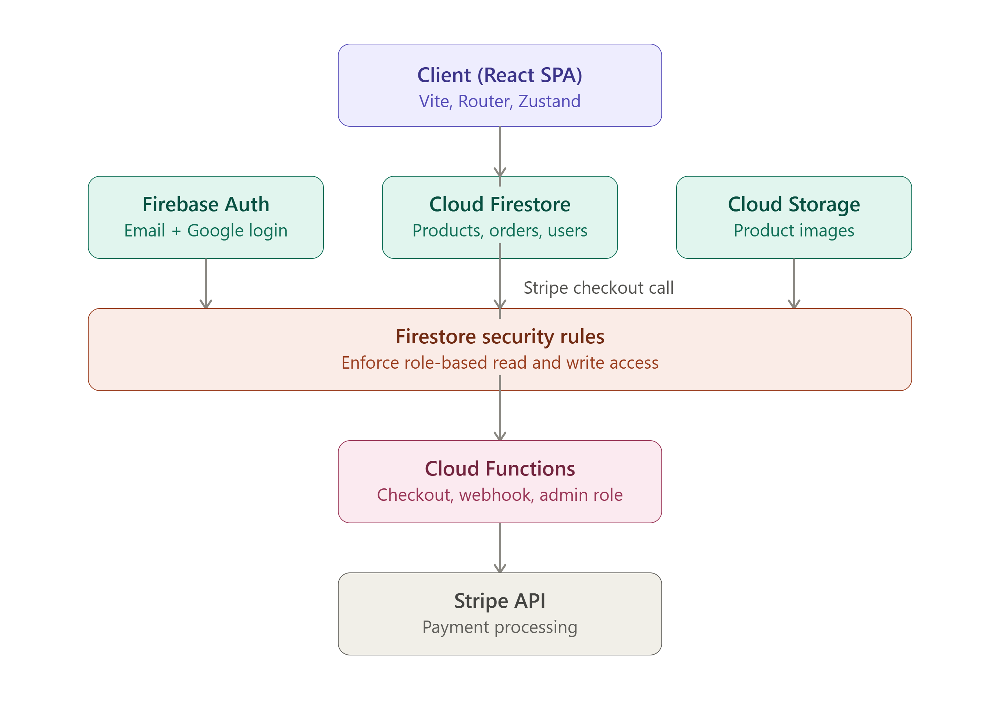
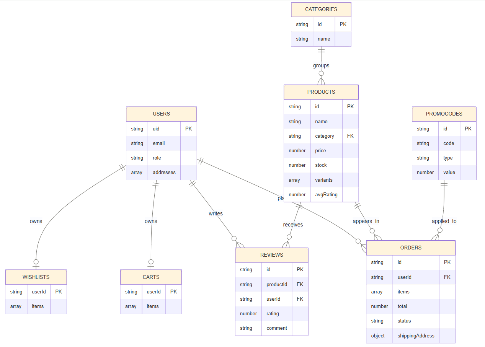
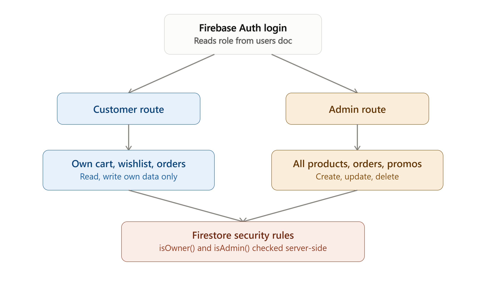
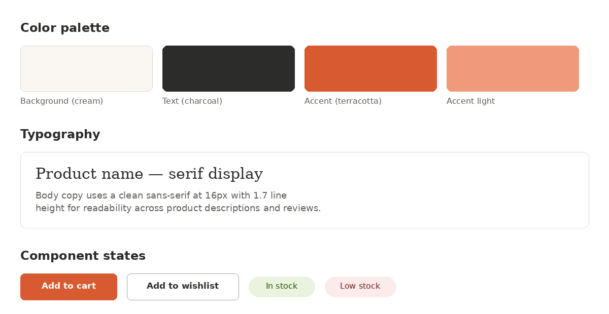
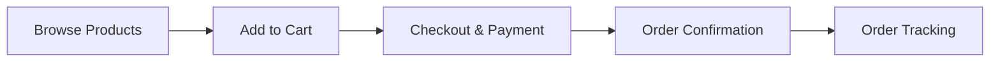

# Ovelia — Modern Lifestyle E-Commerce

A full-stack e-commerce web application for a modern lifestyle/general goods store. Built with React 18 + TypeScript + Vite on the frontend and Firebase as the complete backend.

---

## Tech Stack

| Layer | Technology |
|-------|-----------|
| Frontend | React 18 + TypeScript + Vite |
| Styling | Tailwind CSS + Framer Motion |
| Routing | React Router v6 |
| State | Zustand (cart, auth, wishlist, UI) |
| Backend | Firebase (Auth, Firestore, Storage, Hosting, Functions) |
| Payments | Stripe Checkout (test mode) via Cloud Function |
| Forms | React Hook Form + Zod |
| Charts | Recharts |
| Notifications | react-hot-toast |

---

## System Design & Architecture

### 1. System Architecture

This architecture shows the client SPA talking directly to Firebase's Auth, Firestore, and Storage. Security rules act as a gatekeeper to access. Payments are routed through Cloud Functions to Stripe rather than handled client-side, which is the correct, non-negotiable pattern for real payment processing.

- **Client Layer**: A Single Page Application (SPA) built with React and Vite. It handles routing (React Router), state management (Zustand), and UI rendering (Tailwind CSS, Framer Motion).
- **Authentication**: Firebase Authentication manages user identities, supporting Email/Password and Google sign-in. Custom claims are used for role-based access control (e.g., Admin roles).
- **Data Layer**: Cloud Firestore serves as the primary NoSQL database. Access is secured via Firestore Security Rules.
- **Storage Layer**: Firebase Cloud Storage stores product assets and user-uploaded media.
- **Serverless Functions**: Firebase Cloud Functions handle secure backend processes that cannot be trusted to the client, such as Stripe Checkout sessions, webhooks, and managing admin privileges.
- **External Services**: Stripe is integrated for secure payment processing.

### 2. Firestore Data Model

The data model directly reflects the actual `firestore.rules`. 
- `carts` and `wishlists` are keyed by `userId` directly (one document per user, not a subcollection).
- `reviews` live as a subcollection under `products`.
- `promoCodes` and `categories` are standalone collections separately writable only by admins.

### 3. Role-Based Access Control

Role-based access control defines what read/write operations users can perform based on their authentication status and custom claims, enforced server-side by `firestore.rules`.

### 4. UI/UX Design System Rationale

A quick visual reference for the design tokens actually used (matching the Tailwind config). *Note: The specific colors/fonts should be cross-checked against the actual deployed site screenshots for exact consistency.*

### Customer Journey Flowchart


### The Importance of AI to Rapid Application Development
Artificial Intelligence drastically accelerates the Rapid Application Development (RAD) lifecycle by acting as an intelligent co-pilot during coding, architecture planning, and debugging. In this project, AI assisted in:
- **Code Generation & Boilerplating:** Instantly generating boilerplate code for React components, Tailwind styling, and Firebase configurations, significantly reducing initial setup time.
- **Architectural Guidance:** Recommending best practices for serverless infrastructure (like using Cloud Functions for Stripe to ensure security) and shaping a robust Firestore data model.
- **Debugging & Security:** Identifying potential vulnerabilities in security rules and resolving deployment errors swiftly, ensuring a production-ready application.
- **Continuous Iteration:** Allowing for rapid prototyping and seamless transitions from ideas to functional, dynamic user interfaces.

---

## Prerequisites

- Node.js 18+
- npm or yarn
- [Firebase account](https://console.firebase.google.com) (Blaze plan required for Cloud Functions)
- [Stripe account](https://stripe.com) (free, test mode)
- Firebase CLI: `npm install -g firebase-tools`

---

## Quick Start

### 1. Clone and install

```bash
git clone <your-repo>
cd Ovelia
npm install
```

### 2. Firebase Setup

1. Go to [Firebase Console](https://console.firebase.google.com)
2. Create a new project
3. Enable **Authentication** → Sign-in methods: Email/Password + Google
4. Enable **Firestore** (start in test mode, then apply rules)
5. Enable **Storage**
6. Upgrade to **Blaze plan** (required for Cloud Functions + Stripe outbound calls)

### 3. Configure Environment Variables

```bash
cp .env.example .env
```

Fill in your Firebase config from **Project Settings → General → Your apps**:

```env
VITE_FIREBASE_API_KEY=...
VITE_FIREBASE_AUTH_DOMAIN=...
VITE_FIREBASE_PROJECT_ID=...
VITE_FIREBASE_STORAGE_BUCKET=...
VITE_FIREBASE_MESSAGING_SENDER_ID=...
VITE_FIREBASE_APP_ID=...

VITE_STRIPE_PUBLISHABLE_KEY=pk_test_...
VITE_APP_URL=http://localhost:3000
```

### 4. Deploy Firestore Rules & Indexes

```bash
firebase login
firebase use --add   # Select your project
firebase deploy --only firestore
firebase deploy --only storage
```

### 5. Seed the Database

```bash
# Download your service account key from Firebase Console → Project Settings → Service Accounts
# Save as service-account.json in project root (add to .gitignore!)

set GOOGLE_APPLICATION_CREDENTIALS=./service-account.json
npx ts-node scripts/seed.ts
```

This seeds **15 products** across 4 categories and **3 promo codes** (WELCOME15, SUMMER25, FREESHIP).

### 6. Set Up Cloud Functions

```bash
cd functions
npm install
```

Set Firebase config for Stripe:
```bash
firebase functions:config:set stripe.secret_key="sk_test_YOUR_KEY" \
  stripe.webhook_secret="whsec_YOUR_WEBHOOK_SECRET" \
  app.url="https://YOUR_PROJECT.web.app"
```

Deploy functions:
```bash
firebase deploy --only functions
```

### 7. Create Your Admin User

1. Sign up on the app
2. Use the provided setup script to promote your user to an admin:

```bash
# Ensure you have your service-account.json in the project root
npx ts-node scripts/createAdmin.ts <your-email>
```

3. Sign out and sign back in for the new admin role to take effect.

### 8. Run Development Server

```bash
npm run dev
```

Open [http://localhost:3000](http://localhost:3000)

---

## Stripe Test Cards

| Card | Result |
|------|--------|
| `4242 4242 4242 4242` | Payment succeeds |
| `4000 0000 0000 9995` | Payment fails |

Use any future expiry date and any 3-digit CVV.

---

## Project Structure

```
Ovelia/
├── src/
│   ├── components/
│   │   ├── auth/        # AuthGuard, AdminGuard
│   │   ├── cart/        # CartDrawer, CartItem, CartSummary, PromoCodeInput
│   │   ├── layout/      # Header, Footer, Layout, AdminLayout
│   │   ├── product/     # ProductCard, ProductGrid, Filters, Gallery, Reviews
│   │   └── ui/          # Button, Input, Badge, Modal, Skeleton, StarRating, EmptyState
│   ├── hooks/           # useProducts, useProduct, useOrders, useReviews, etc.
│   ├── lib/             # firebase.ts, firestore.ts, utils.ts
│   ├── pages/
│   │   ├── admin/       # Dashboard, Products, Orders, Customers, PromoCodes, Reviews
│   │   ├── account/     # AccountPage, OrderHistory, OrderDetail, Profile
│   │   └── auth/        # Login, Signup, ForgotPassword
│   ├── store/           # authStore, cartStore, wishlistStore, uiStore
│   ├── types/           # index.ts (all shared TypeScript types)
│   ├── App.tsx          # Router configuration
│   └── main.tsx         # Entry point
├── functions/
│   └── src/index.ts     # Cloud Functions (createCheckoutSession, stripeWebhook, setAdminRole)
├── scripts/
│   └── seed.ts          # Database seed script
├── firebase.json        # Firebase hosting + functions config
├── firestore.rules      # Security rules
├── firestore.indexes.json
└── storage.rules
```

---

## Promo Codes (Seeded)

| Code | Discount | Min Order |
|------|----------|-----------|
| `WELCOME15` | 15% off | None |
| `SUMMER25` | $25 off | $100 |
| `FREESHIP` | $6.99 off (free shipping) | None |

---

## Deployment

```bash
# Build frontend
npm run build

# Deploy everything
firebase deploy
```

Your app will be live at `https://YOUR_PROJECT_ID.web.app`

---

## License

MIT
